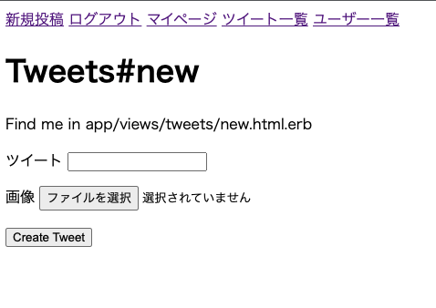

# Rails App

## 概要
Ruby on Railsで作成した簡易ツイートアプリ（CRUD処理を実装）

## アプリ機能
- ログイン機能
  - メールアドレス・パスワードでのユーザー作成・ログイン
  - ログインしていない場合、ツイート等の閲覧のみに制限
  - ユーザーの一覧表示、詳細情報表示に対応
- ツイート機能
  - ツイートの投稿、編集、削除、一覧表示に対応
  - ツイート投稿では、画像ファイルの添付が可能
- お気に入り機能
  - ツイートのお気に入り登録/解除に対応
- コメント機能
  - ツイートに対するコメントの投稿、編集、削除、一覧表示に対応
- フォロー/フォロワー機能
  - ユーザーに対するフォロー登録/解除に対応
  - フォローされたユーザーにはフォロワー情報を付加

## AWSとの連携
- データベースはAmazon RDS for MySQLに接続
- 投稿画像はAmazon S3に保存

## 実行画面
- ログイン画面  

- ツイート一覧画面  

- ツイート投稿画面  

- ツイート詳細画面  

- コメント一覧画面  

- コメント詳細画面  

- ユーザー一覧画面  

- ユーザー詳細画面  

